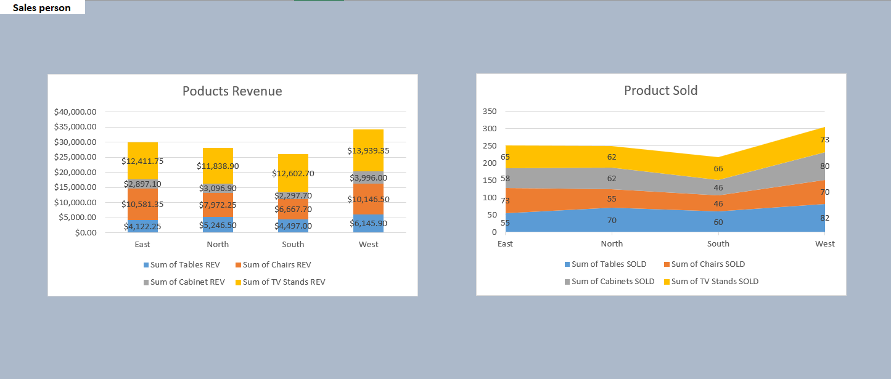

# Sales Performance & Commission Analysis Dashboard

## Project Overview

This project is an end-to-end data analysis solution built in Excel to monitor sales efficiency, 
regional performance, and commission payouts. It transforms a complex dataset into an 
interactive dashboard that allows stakeholders to filter performance by region and product 
category.

## Key Features

- Interactive Slicers: Dynamic filtering for regions (East, North, South, West) that updates
  all charts instantly.
- Automated Commission Logic: Integrated formulas that calculate Total Pay and Net Profit
  based on sales volume and baseline salaries.
- Multi-Layered Visualizations: Includes profit rankings, volume trends, and revenue mix
  analysis.

## Dashboard Gallery

### 1. Commission vs. Profitability

A specialized chart used to ensure that commission payouts are scaling correctly with net 
profitability. 

### 2. Revenue Mix

A visualization of which products (Tables, Chairs, Cabinets, TV Stands) are driving growth
in each specific territory. 

### 3. Regional Volume

## Data Insights & Performance

Based on the analysis of $118,459.85 in total revenue, the following insights were discovered:

### Top Performers (by Net Profit)

| Salesperson | Net Profit | Total Revenue |
| :--- | :--- | :--- |
| **Wilbur Lowe** | $900.38 | $3,050.75 |
| **Garrett Simons** | $877.40 | $3,004.80 |
| **Natasha Harrington** | $835.45 | $2,920.90 |
| **Darlene Hill** | $786.00 | $2,891.65 |
| **Grand Total** | **$7,506.23** | **$118,459.85** |

### Regional Highlights

- Top Region: The West region is the strongest performer, contributing $34,227.75 to the
  total revenue.
- Best Selling Product: TV Stands are the primary revenue driver, generating $50,792.70
  globally.

## Technical Skills Demonstrated

- Advanced Excel: Pivot Tables, Slicers, and Data Modeling.
- Financial Analysis: ROI tracking, Commission structures, and Profitability reporting.
- Data Visualization: Creating professional-grade combination and stacked charts.

## Conclusion

This dashboard serves as a vital tool for sales managers to identify high-performing individuals
and regional growth opportunities. By bridging the gap between raw transaction data and 
visual storytelling, it enables data-driven decision-making for commission planning and
inventory focus.
