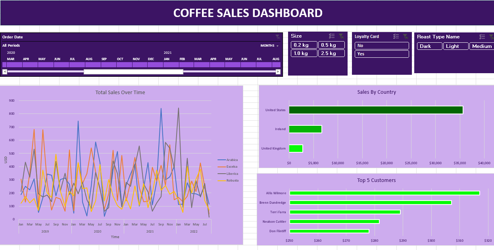

☕ Coffee Sales Dashboard | Excel
📌 Overview

Developed an interactive Excel dashboard to analyze coffee sales performance, customer behavior, and product trends across multiple countries.

The dashboard provides insights into:

Sales trends over time
Product category performance
Customer purchasing patterns
Geographic sales distribution
🚀 Key Features
📈 Sales Trend Analysis
Monthly and yearly sales tracking
Comparative analysis across coffee types
🌍 Sales by Country
Identified top-performing regions
Compared revenue contribution across countries
👥 Customer Insights
Highlighted top customers based on sales
Analyzed loyalty card impact on purchasing behavior
🎛 Interactive Filters

Implemented slicers for:

Date range
Product size
Loyalty card status
Roast type
🛠 Tools Used
Microsoft Excel
Pivot Tables
Pivot Charts
Slicers
Dashboard Design
📊 Dashboard Insights
United States generated the highest sales revenue
Loyalty card users showed stronger purchasing consistency
Certain roast types performed better across specific regions
🎯 Outcome

Built a business-focused dashboard to transform raw sales data into actionable insights, improving reporting and decision-making.

🖼 Dashboard Preview

(Add your screenshot here)

👨‍💻 Author

Abdul Haseeb
